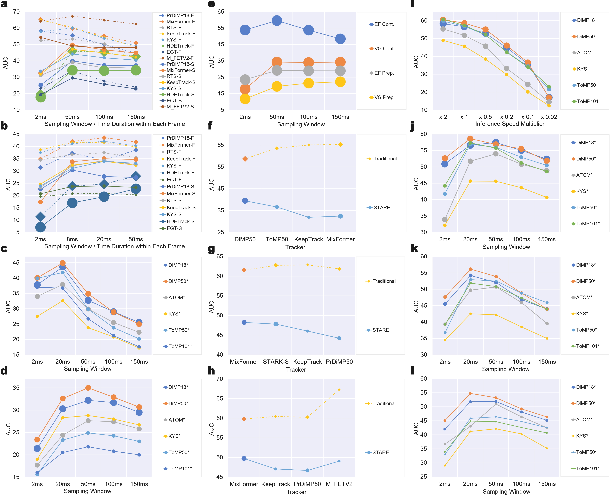
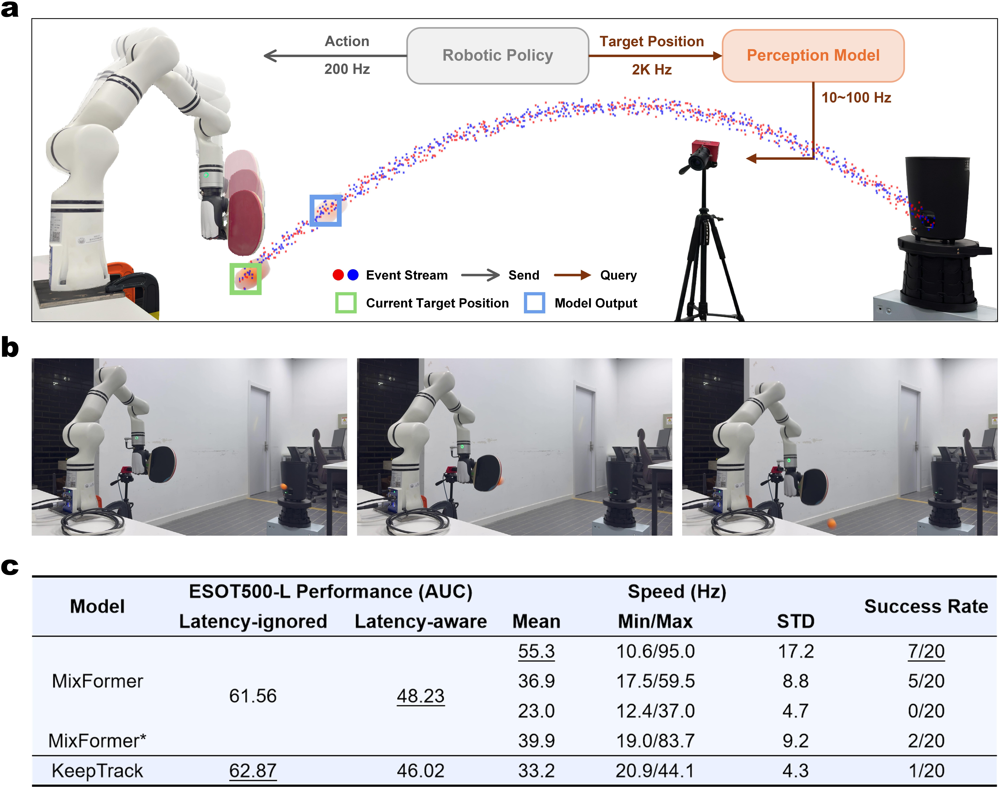
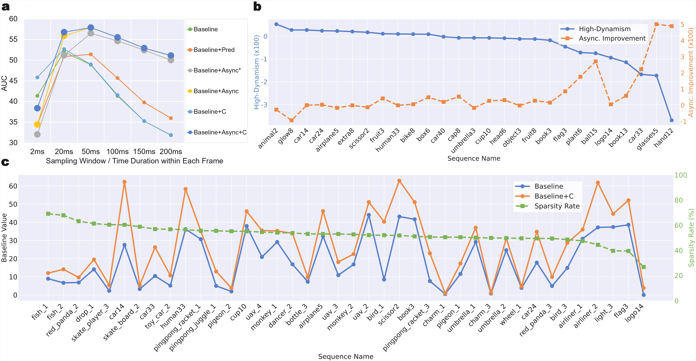

# Bridging the Latency Gap with a Continuous Stream Evaluation Framework in Event-Driven Perception

<br>

Neuromorphic vision systems process asynchronous event streams and offer transformative potential for low-latency real-time applications like robotics. However, their evaluation remains tethered to methodologies derived from RGB imaging. These traditional approaches convert continuous event streams into fixed-rate frames and ignore perception latency, creating a critical gap between benchmarks and real-world performance. We introduce the STream-based lAtency-awaRe Evaluation (STARE) framework, designed to align with the intrinsic continuity of event-driven perception. STARE integrates two core components: Continuous Sampling and Latency-Aware Evaluation. Continuous Sampling processes new events immediately after the prior inference cycle to maximize throughput. Latency-Aware Evaluation quantifies latency-induced performance loss by matching
high-frequency ground truth to the latest perception model output. To enable rigorous validation of STARE, we developed ESOT500, a dataset with 500 Hz annotations that captures high-dynamic object motion without temporal aliasing. Experiments reveal that perception latency severely degrades online performance, with accuracy dropping by over 50% compared to the traditional framework. This
finding is further confirmed by our event-driven robotic ping-pong experiments, with a 55% increase in latency leading to complete task failure. We further propose two model enhancement strategies to mitigate this degradation: Asynchronous Tracking and ContextAware Sampling. Asynchronous Tracking boosts throughput using a dual lightweight-heavyweight architecture. Context-Aware Sampling adapts input based on target-specific event density. Together, these
strategies reduce latency-induced accuracy loss by 61% while increasing model speed by 78%. Our work establishes a new paradigm that prioritizes temporal congruence in neuromorphic system evaluation, bridging the gap between theoretical potential and real-world deployment.

<br>

<details open="open" style='padding: 10px; border-radius:5px 30px 30px 5px; border-style: solid; border-width: 1px;'>
  <summary>Table of Contents</summary>
  <ol>
    <li>
      <a href="#stare">STARE</a>
    </li>
    <li>
      <a href="#esot500-dataset">ESOT500 Dataset</a>
    </li>
    <li>
      <a href="#experiments">Experiments</a>
    </li>
    <li>
      <a href="#model-enhancement-strategies">Model Enhancement Strategies</a>
    </li>
    <li>
      <a href="#usage">Usage</a>
    </li>
    <li>
      <a href="#demo">Demo</a>
    </li>
    <li>
      <a href="#full-reproduction">Full Reproduction</a>
    </li>
    <li>
      <a href="#support">Support</a>
    </li>
    <li>
      <a href="#license">License</a>
    </li>
    <li>
      <a href="#acknowledgments">Acknowledgments</a>
    </li>
  </ol>
</details>

<br>

## STARE

STARE is an abbreviation for STream-based lAtency-awaRe Evaluation.

Please refer to the paper for more details.


<p align="center">
  
</p>
<p align="left">
  <em><strong>STream-based lAtency-awaRe Evaluation (STARE) for event-driven perception.</strong> <strong>a,</strong> Traditional RGB perception pipeline. Visual information is captured as discrete, fixed-rate frames. The perception model processes frames sequentially, introducing perceptual delays as inference is gated by the arrival of each new frame (i.e., waiting for the next frame to start processing). <strong>b,</strong> Frame-based, latency-ignored evaluation of event vision. Mirroring RGB paradigms, the continuous event stream is preprocessed into fixed-rate event frames. Model outputs (orange bounding box) are evaluated against ground truth within the corresponding input frame, ignoring the impact of perception latency on real-time accuracy. <strong>c,</strong> The proposed STream-based lAtency-awaRe Evaluation (STARE) framework. STARE operates directly on the continuous event stream: inference initiates immediately after the prior cycle concludes (at timestamps $t_i$, $t_{i+1}$, $t_{i+2}$). Latency-Aware Evaluation matches each high-frequency ground truth (e.g., at $t_j$) to the latest model prediction, directly penalizing stale outputs. <strong>d,</strong> Example of event-driven perception under STARE. Compared to the frame-based approach in (b), STARE’s Continuous Sampling enables higher throughput, reducing temporal misalignment between model predictions (blue bounding box) and ground truth (green bounding box).</em>
</p>

<br><br>

## ESOT500 Dataset
To enable rigorous validation of STARE, we present ESOT500, a new dataset for event-based visual object tracking, a classical perception task that places high demands on the real-time capabilities of models. ESOT500 features high-frequency (500 Hz) and time-aligned annotations.

Please refer to the paper for more details.

<p align="center">
  
</p>
<p align="left">
  <em><strong>The ESOT500 dataset for high-dynamic event-driven perception.</strong> <strong>a,</strong> Representative event stream samples from the low-resolution ESOT500-L subset (346 × 260, top row) and high-resolution ESOT500-H subset (1280 × 720, bottom row), showcasing diverse high-dynamic scenarios (e.g., flag waving, bicycle riding, car driving, cap shaking, football playing, monkey swinging, fan rotating, pigeon taking off, bottle spinning, breakdancing). <strong>b,</strong> Scene category distribution for ESOT500-L (left) and ESOT500-H (right), quantifying the percentage of sequences across attributes like object similarity, background complexity, deformation, occlusion, motion speed, and indoor/outdoor setting. <strong>c,</strong> Comparative of event-based object tracking datasets. ESOT500-L and ESOT500-H stand out with 500 Hz time-aligned annotations, high resolution (up to 1280×720 for ESOT500-H), and diverse scene coverage, addressing gaps in prior datasets (e.g., low annotation frequency, lack of time-aligned labels).</em>
</p>

<br>

<p align="center">
  
</p>
<p align="left">
  <em><strong>Temporal aliasing in event-driven perception and ESOT500’s solution.</strong> <strong>a,</strong> Conceptual illustration of temporal aliasing. The green solid line denotes the true continuous object state over time; black dots are low-frequency periodic annotations; the yellow dashed line is the trajectory reconstructed from sparse annotations. For simple motion (top), reconstruction approximates the truth, but for complex motion (bottom), low-frequency sampling causes distorted reconstruction (temporal aliasing). <strong>b,</strong> Reconstruction Error (RE, mean ± STD) for ESOT500-H (blue) and ESOT500-L (orange) as a function of annotation frequency. RE is substantial at low frequencies and gradually decreases when approaching 500 Hz, validating ESOT500’s ability to mitigate aliasing via high-frequency annotation. <strong>c,</strong> RE curves for representative sequences in ESOT500-L (airplane, book, cap, bike, umbrella). <strong>d,</strong> RE curves for representative sequences in ESOT500-H (bird, bottle, badminton racket, skate player, fan). e, Visual comparison of high-frequency ground truth annotations (green boxes) and sparse 20 Hz interpolated boxes (yellow) for three objects (fan, bottle, badminton racket). Interpolated boxes deviate significantly from ground truth, emphasizing the need for dense annotation to address temporal aliasing.</em>
</p>


<br><br>

## Experiments
To quantify the impact of perception latency on event-driven perception, we leverage the STARE framework to evaluate various visual object tracking models. This evaluation centers on the ESOT500 dataset, tailored for high-dynamic, low-latency assessment, and extends to external benchmarks to verify generalizability.

To examine the real-world impact of perception latency, we further conducted an
event-driven robotic ping-pong experiment.

Please refer to the paper for more details.

<p align="center">
  
</p>
<p align="left">
  <em><strong>Impact of perception latency on event-driven trackers across datasets and hardware.</strong> <strong>a,</strong> Tracking accuracy (AUC) under STARE (-S, solid lines) vs. traditional frame-based evaluation (-F, dashed lines) on ESOT500-L. M_FETV2 stands for Mamba FETrackV2. Larger markers indicate faster inference. STARE reveals the impact of perception latency on accuracy hidden by traditional methods. Accuracy generally peaks at an optimal sampling window size under STARE. <strong>b,</strong> Same as (a) but on ESOT500-H, validating STARE’s consistency across dataset resolutions. The unimodal AUC vs. sampling window size trend persists. <strong>c,</strong> STARE performance on FE108: AUC vs. sampling window size for diverse trackers. The consistent unimodal trend across datasets (vs. ESOT500) highlights STARE’s generalizability to external benchmarks. <strong>d,</strong> STARE performance on VisEvent: AUC vs. sampling window size. Results mirror (a–c), reinforcing the unimodal trend. <strong>e,</strong> Ablation of sampling methods with HDETrack: Continuous Sampling (STARE, “Cont.”) vs. fixed-rate sampling from preprocessed frames (“Prep.”), using EventFrame (EF) and VoxelGrid (VG) representations. Continuous Sampling outperforms, leveraging event stream temporal continuity. <strong>f–h,</strong> Performance ranking reversals under STARE at 2ms (f), 20ms (g), and 50ms (h) sampling window sizes. Faster models (e.g., DiMP50, MixFormer) outperform slower counterparts with high traditional accuracy, demonstrating STARE’s bias toward throughput. <strong>i,</strong> Accuracy degradation with simulated inference latency (speed multiplier < 1 slows inference). All models show monotonic AUC drops, quantifying latency’s direct impact. <strong>j–l,</strong> STARE performance on hardware with varying configurations: (j) RTX 3090 (high-power), (k) RTX 3080Ti (lower-power, accuracy drop vs. 3090), (l) RTX 3080Ti with parallel task contention (further degradation), illustrating how different hardware configurations impact to latency.</em>
</p>

<br>

<p align="center">
  
</p>
<p align="left">
  <em><strong>Real-world robotic ping-pong experiment.</strong> <strong>a,</strong> Perception-action loop experimental setup. An event camera captures the ping-pong ball trajectory (event stream, red/blue points) at 1 MHz. An upstream tracker (orange) runs at tens of Hz, outputting bounding boxes (blue) to a downstream robotic policy (gray). The policy queries for target positions at 2 kHz and sends control actions to the robotic arm at 200 Hz. <strong>b,</strong> An example of a successful robot hitting back a ping-pong ball. <strong>c,</strong> Robotic ping-pong task success rate across perception models. Metrics include: ESOT500-L performance (AUC, latency-ignored vs. latency-aware), model speed (Hz, mean, min/max, STD), and success rate (successful hits / 20 trials). Underlined values indicate column maxima. MixFormer (high speed) achieves the highest success rate (7/20), while frame-based variants (e.g., MixFormer∗) or high-offline-accuracy/low-speed models (KeepTrack) show reduced success, validating latency’s critical role in real-time task.</em>
</p>

<br><br>

## Model Enhancement Strategies

We derive two biologically inspired principles: Predictive Motion Extrapolation
104 and Context-Aware Sampling.

Please refer to the paper for more details.

<p align="center">
  
</p>
<p align="left">
  <em><strong>Model enhancement strategies: Asynchronous Tracking and Context-Aware Sampling.</strong> <strong>a,</strong> Architecture of Asynchronous Tracking. A slow, high-fidelity base model (orange) performs full inference on event segments, generating initial bounding boxes and sharing features with a fast residual model (green). The residual model recursively updates predictions using shared features and new events, producing high-frequency outputs between base model cycles, leveraging temporal continuity of event stream to boost throughput. <strong>b,</strong> Qualitative example of Context-Aware Sampling in sparse-event scenarios. Top row: Baseline model fails to localize the target (red box) as event density drops. Bottom row: Enhanced model detects sparse events, enters an inactive state, and reuses the last correct prediction (dashed green box) until dense events trigger accurate inference, preventing error accumulation. <strong>c,</strong> Context-Aware Sampling preventing target loss during prolonged inactivity. Top row: Baseline tracker accumulates errors over time and loses the target. Bottom row: Enhanced tracker uses a timer to force reactivation after prolonged inactivity, re-localizing the target before drift causes target loss, balancing efficiency and accuracy.</em>
</p>

<br>

<p align="center">
  
</p>
<p align="left">
  <em><strong>Quantitative evaluation of model enhancement strategies under STARE.</strong> <strong>a,</strong> Accuracy (AUC) of OSTrack-based (68) variants across sampling window sizes. Curves compare: Baseline (green), +Predictive Motion Extrapolation (+Pred, orange), +Context-Aware Sampling (+C, light blue), +Asynchronous Tracking (trained on 500 Hz annotations, yellow), and +Asynchronous Tracking (trained on 20 Hz annotations, gray). Asynchronous Tracking (500 Hz) combined with Context-Aware Sampling (+Async+C, dark blue) consistently outperforms other strategies. <strong>b,</strong> Motion dynamism vs. Asynchronous Tracking effectiveness. Blue solid line: high-dynamism score (left y-axis, negative performance gain from Predictive Motion Extrapolation, also defined as the unpredictability score) for ESOT500-L sequences. Orange dashed line: Accuracy improvement (right y-axis) from Asynchronous Tracking. Higher dynamism poses greater challenge. <strong>c,</strong> Context-Aware Sampling performance in sparse-event scenarios. Blue line: Baseline accuracy (left y-axis). Orange line: Accuracy with Context-Aware Sampling (left y-axis). Green dashed line: Sparsity Rate (right y-axis, percentage of model inactivity). Context-Aware Sampling demonstrates robustness in low-motion contexts.</em>
</p>

<br><br>

## Usage
The code is based on the [**PyTracking**](https://github.com/visionml/pytracking) and other similar frameworks. These frameworks, including PyTracking, are designed for visual object tracking, which is the main task we adopted to validate STARE in our work.

To support more perception tasks and make it easier for users to integrate them into STARE, we developed a streamlined STARE framework repository. Please refer to [**STARE (streamlined)**](https://github.com/BXZZcj/STARE_streamlined).

### System Requirements
The code is compatible with *Linux* systems equipped with *NVIDIA* GPUs.
The software versions of the base experimental environment used for testing are:
- Ubuntu 20.04
- Python 3.8
- CUDA 11.3
- PyTorch 1.10.0
 
  For more detailed information about Python dependencies, their versions, and other details, please refer to the exported requirement file [lib/stare_conda_env.yml](lib/stare_conda_env.yml).

<br>

### Dataset and Checkpoints Preparation
**1.** Download
- Please refer to [Demo](#demo) if you wanna quickstart.

- Download **ESOT500** from our [[Hugging Face]](https://huggingface.co/datasets/NoRealBlank/ESOT500/tree/main) datasets repository. The compressed dataset file is about 13.4 GB in size, and downloading it at a speed of 3 MB/s is expected to take approximately 1.5 hours.

    ##### ESOT500 Structure
    ```
    |-- ESOT500    
        |-- aedat4
        |   |-- sequence_name1.aedat4
        |   |-- sequence_name2.aedat4
        |   :   :
        |
        |-- anno_t
        |   |-- sequence_name1.txt
        |   |-- sequence_name2.txt
        |   :   :
        |
        |-- [{FPS}_w{window}ms] # For frame-based latency-free evaluation, need a pre-slice preprocessing.
        :   :
        |
        |-- test.txt
        |-- train.txt
        |-- test_additional.txt
        |-- train_additional.txt
        |-- test_challenging.txt
    ```

- The aedat4 directory contains the raw event data (event stream and corresponding RGB frames), the [DV](https://inivation.gitlab.io/dv/dv-docs/docs/getting-started.html) and [dv-python](https://gitlab.com/inivation/dv/dv-python) is recommended for visualization and processing in python respectively.

- You can find the metadata file at `data/esot500_metadata.json`, or download it from our dataset page in [[Hugging face]](https://huggingface.co/datasets/NoRealBlank/ESOT500).

- We also provide some checkpoint files of trackers in [[Hugging face]](https://huggingface.co/datasets/NoRealBlank/ESOT500) to download.

**2.** Preparation for Frame-Based Latency-Free Evaluation

For frame-based latency-free evaluation, you need to perform a pre-slice preprocessing, as described in the original paper. Just run the following python command:

```
python [/PATH/TO/STARE]/lib/event_utils_new/esot500_preprocess.py --path_to_data [/PATH/TO/ESOT500] --fps [FPS] --window [MS]
```
the arguments `FPS` and `MS` should follow the chart bellow, as shown in the Table. 2 of the paper:

<center>

#### Pre-Slicing Settings (fps/ms)
| 500/2 | 250/2 | 20/2 | 500/50 | 250/50 | 20/50 | 500/100 | 250/100 | 20/100 | 500/150 | 250/150 | 20/150 |
|----|----|---|---|---|--|---|---|---|----|---|--|

</center>

**3.** Preparation for STARE

To prepare data for STARE experiments, you need to do the following:
```
python [/PATH/TO/STARE]/lib/event_utils_new/esot500_preprocess.py --path_to_data [/PATH/TO/ESOT500] --fps 500 --window 2
ln -s [/PATH/TO/ESOT500]/500_w2ms [/PATH/TO/ESOT500]/500
```

<br>

### Trackers under PyTracking

As mentioned at the beginning of the Usage section, the code is based on the [**PyTracking**](https://github.com/visionml/pytracking) and other similar frameworks.

Below are the instructions to configure and run the tracker under PyTracking.

**1.** Create a virtual environment and install required libraries.

You can use the requirements file [lib/stare_conda_env.yml](lib/stare_conda_env.yml) we exported to build the environment. The entire installation process takes about 0.5h to 1h, depending on the network environment.
```
cd [/PATH/TO/STARE]

conda env create -f ./lib/stare_conda_env.yml --verbose --debug
conda activate stare
```

Besides, our code is mainly built based on PyTracking, and you can also refer to [lib/pytracking/INSTALL.md](lib/pytracking/INSTALL.md) for detailed installation and configuration.
```
conda create -n stare python=3.8
conda activate stare
[pip/conda install ...]
```

**2.** Preprare the dataset.
```
ln -s [/PATH/TO/ESOT500] ./data/ESOT500
```

**3.** Go to the working directory of pytracking.
```
cd ./lib/pytracking
```

**4.** Set environment for pytracking.
```
python -c "from pytracking.evaluation.environment import create_default_local_file; create_default_local_file()"
python -c "from ltr.admin.environment import create_default_local_file; create_default_local_file()"
```

**5.** Modify the dataset path `settings.esot500_dir` in generated environment setting files.
- for training: `ltr/admin/local.py`
- for testing: `pytracking/evaluation/local.py`
- please directly place the pre-trained tracker checkpoints files in: `settings.network_path`

**6.** Run frame-based evaluation demo. 

(Experiment settings are in folder `pytracking/experiments` and `pytracking/stream_settings`)
```
# pre-slice the '20_w50ms'(fps=20 & windows=50ms) subset
python [/PATH/TO/STARE]/lib/event_utils_new/esot500_preprocess.py --path_to_data [/PATH/TO/ESOT500] --fps 20 --window 50

# run three trackers(atom, dimp18 and kys) for 'fps=20 & windows=50ms' settings
python pytracking/run_experiment.py exp_frame fast_test_offline
```

**Note:** 

The details of `fast_test_offline` setting are as follows:
```
def fast_test_offline():
    trackers =  trackerlist('atom', 'default', range(1)) + \
                trackerlist('dimp', 'dimp18', range(1)) + \
                trackerlist('kys', 'default', range(1))
    dataset = get_dataset('esot_20_50')
    return trackers, dataset
```
- `range(1)` means `run_id=0`, and the tracking results will be saved in `pytracking/output/tracking_results/{tracker_name}/{tracker_params}_{run_id}/`, e.g. `pytracking/output/tracking_results/atom/default_000/`
- if you set `run_id=None`, the tracking results will be saved in `pytracking/output/tracking_results/{tracker_name}/{tracker_params}/`, e.g. `pytracking/output/tracking_results/atom/default/`
- you can change the paths by modifying the relevant variables in `local.py`

**7.** Run stream-based latency-aware evaluation demo. 

(Experiment settings are in folder `pytracking/experiments` and `pytracking/stream_settings`.)
```
# prepare data for STARE experiments (If you have done this before, you can skip this step.)
python [/PATH/TO/STARE]/lib/event_utils_new/esot500_preprocess.py --path_to_data [/PATH/TO/ESOT500] --fps 500 --window 2
ln -s [/PATH/TO/ESOT500]/500_w2ms [/PATH/TO/ESOT500]/500

# run three trackers(atom, dimp18 and kys) for 'real streaming & windows=20ms' settings
python pytracking/run_experiment_streaming.py exp_stare fast_test_stare

# align the prediction with GT timestamp
python eval/streaming_eval_v3.py exp_stare fast_test_stare
```
The instructions given are for real-time testing on your own hardware. 
If you want to reproduce the results in our paper, please refer to `pytracking/stream_settings/s100`.

**Note:** 

The details of `fast_test_stare` setting are as follows:
```
trackers_fast_test =  trackerlist('atom', 'default') + \
            trackerlist('dimp', 'dimp18') + \
            trackerlist('kys', 'default')

def fast_test_stare():
    trackers = trackers_fast_test
    dataset = get_dataset('esot500s')
    stream_setting_id = 100  # Default streaming setting, for real-time testing on your own hardware. 
    stream_setting = load_stream_setting(f's{stream_setting_id}')
    return trackers, dataset, stream_setting
```
- currently, default `run_id` is `None` and `stream_setting_id=100`, the tracking results will eventually be saved in `pytracking/output/tracking_results_rt_final/{tracker_name}/{tracker_params}/{stream_setting_id}/`, e.g. `pytracking/output/tracking_results_rt_final/atom/default/100/`
- if you set `run_id=0`, the tracking results will be saved in `pytracking/output/tracking_results_rt_final/{tracker_name}/{tracker_params}_{run_id}/{stream_setting_id}/`, e.g. `pytracking/output/tracking_results_rt_final/atom/default_000/100/`
- you can change the paths by modifying the relevant variables in `local.py`

**8.** To evaluate the results, use `pytracking/analysis/analysis_results_demo.ipynb`. 

You can also refer to it to write the analysis scripts of your own style.

**Note:** For tracker enhancement, please see the follow-up section.

<br>

### Trackers under other frameworks:

These trackers use a similar framework to PyTracking, but are not fully integrated into it. 
Here we take **OSTrack** and **pred_OSTrack** as examples to illustrate the usage, including that of the enhancement.

**1.** Go to the working directory.
```
cd lib/sotas/[OSTrack or pred_OSTrack]
```

**2.** Activate the virtual environment.
```
conda activate stare
```

**3.** Install the missing libraries.

(If you use the requirements file we provide, you can skip this step.)
```
[pip/conda install ...]
```
In fact, if you have PyTracking installed, you can directly find and install the missing packages according to the error by running the subsequent scripts.
Only a few dependencies are different, and it takes a few minutes to install.

**4.** Set environment for the tracker.
```
python -c "from lib.test.evaluation.environment import create_default_local_file; create_default_local_file()"
python -c "from lib.train.admin.environment import create_default_local_file; create_default_local_file()"
```

**5.** Modify the dataset path `settings.esot500_dir` in generated environment setting files.
- for training: `lib/train/admin/local.py`
- for testing: `lib/test/evaluation/local.py`
- please place the pre-trained tracker checkpoints in: `settings.network_path`

**6.** Run frame-based evaluation demo. 
```
python tracking/test.py ostrack esot500mix --dataset_name esot_20_50
```
Similar as `Trackers under PyTracking`, the results are by default in the folders `lib/test/tracking_results`.

**Note:** 
- This doesn't work for **pred_OSTrack**.
- The available `dataset_name` can refer to the experiment results listed in our paper.

**7.** Run stream-based latency-aware evaluation demo **without predictive module**.
```
python tracking/test_streaming.py ostrack esot500_baseline s100 --dataset_name esot500s [--runid 66 --use_aas]
python tracking/streaming_eval_v4.py ostrack esot500_baseline s100 --dataset_name esot500s [--runid 66]
```
Similar as `Trackers under PyTracking`, the results are by default in the folders `lib/test/tracking_results_rt_final`.

**Note:**
- `--use_aas` option is currently only available to **OSTrack** and **pred_OSTrack**.
- you can change the relevant parameters in `streaming_eval_v4.py` to make it fit your own style

**8.** Run stream-based latency-aware evaluation demo **with predictive module**.
```
# under pred_OSTrack dir
python tracking/test_streaming.py ostrack pred_esot500_4step s100 --dataset_name esot500s --pred_next 1 [--runid 66 --use_aas]
python tracking/streaming_predspeed.py ostrack pred_esot500_4step s100 [--runid 66]
```
Similar as `Trackers under PyTracking`, the results are by default in the folders `lib/test/tracking_results_rt_final`.

**Note:**
- `--pred_next 1` option is currently only available to **pred_OSTrack**.
- you can change the relevant parameters in `streaming_predspeed.py` to make it fit your own style

**9.** To evaluate the results, use `lib/test/analysis/analysis_results_demo.ipynb`. 

You can also refer to it to write the analysis scripts of your own style.

<br><br>

## Demo

**Note**: The entire process of downloading and running takes approximately 10 minutes.

**1.** Preparation of Tracker Checkpoints and Sample Data

-  Download the [`dimp18`](https://drive.google.com/file/d/11MFQzqnZbbZ92e9zjvb8TBxLSU7WVhZk/view?usp=sharing) tracker checkpoints and place them in the `settings.network_path` directory (as detailed in [Usage/trackers-under-pytracking](#trackers-under-pytracking)).
-  Download the demo sequence [`airplane5`](https://drive.google.com/drive/folders/13QQOWbevKulELizRH2PouQr_nibPxy_n?usp=sharing) (which belongs to the test split of the ESOT500 dataset) and place all the downloaded directories/files in the `../data/ESOT500` directory (as detailed in [Usage/trackers-under-pytracking](#trackers-under-pytracking)) .

**2.** Go to the working directory of pytracking.
```
cd lib/pytracking
```

**3.** Streaming-Based Latency-Aware Tracking

- Then run `python pytracking/run_tracker_streaming.py` to track the target object using `dimp18`.

**4.** Visualization

- Then run `python pytracking/visualize_stare_result.py` to visualize the tracking results.

<br><br>

## Full Reproduction

We also provide a bash script to reproduce almost all the results mentioned in the paper. To use the script, you need first build the [`stare` conda environment](#trackers-under-pytracking) and download the [ESOT500 dataset and all the tracker checkpoints](#dataset-and-checkpoints-preparation) we provide, then execute the following command:
```
cd [your/path/to/STARE]

export ESOT500_DIR='/your/path/to/ESOT500'
export STARE_CKPTS_DIR='/your/path/to/stare_ckpts'

bash lib/stare.sh 2>&1 | tee stare.log
```

After this, you can use the corresponding Jupyter Notebook (Pytracking tracker:`/pytracking/analysis/analysis_results_all.ipynb` or SOTAs tracker:`/lib/test/analysis/analysis_results_demo.ipynb`) to evaluate the results.

<br><br>

## Support

**If you encounter any issues while using our code or dataset, please feel free to contact us.**

<br><br>

## License
- The released code is under [GPL-3.0 license](https://www.gnu.org/licenses/gpl-3.0.en.html) following the PyTracking.
- The released dataset is under [CC-BY 4.0 license](https://creativecommons.org/licenses/by/4.0/).

<br><br>

## Acknowledgments
- The benchmark is built on top of the great [PyTracking](https://github.com/visionml/pytracking) library.
- Thanks for the great works including [Stark](https://github.com/researchmm/Stark), [MixFormer](https://github.com/MCG-NJU/MixFormer), [OSTrack](https://github.com/botaoye/OSTrack) and [Event-tracking](https://github.com/ZHU-Zhiyu/Event-tracking).
